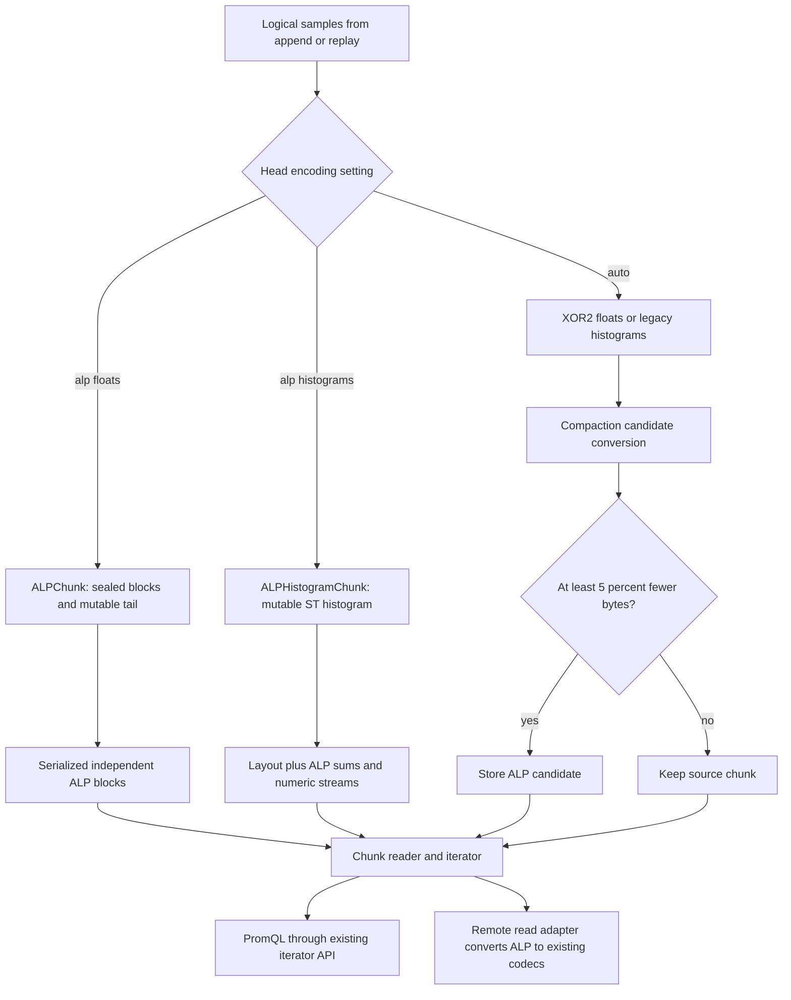

# ALP implementation: architecture, formats, execution, and tradeoffs

This report describes the implementation at `5b5b11813f69474b1621c00fb47101637abf298a`
on `tsdb-alp-optimization`. It covers both the initial implementation and the
subsequent optimizations. The report describes implemented behavior; proposed
experiments are identified separately. Publishing this report does not change
the codec.

The implementation adds lossless floating-point and native-histogram chunk
encodings to Prometheus. It uses explicit Go SIMD operations when built with
the experimental toolchain support, and ordinary scalar Go otherwise. The
serialized data is independent of that build choice.

The most useful companion documents are the [float format](format/alp.md),
[histogram format](format/alp_histograms.md),
[optimization measurements](alp-optimization-results.md),
[fresh XOR2 comparison](benchmarks/alp-xor2-20260929/report.md), and
[fresh histogram comparison](benchmarks/alp-histograms-20260929/report.md).

For navigation, the main paths through this report are:

- [Float lifecycle and storage](#4-float-chunk-mutation-and-ownership).
- [Exact decimal conversion and selection](#7-exact-decimal-conversion).
- [Packing and SIMD decoding](#10-compact-vertical-packing).
- [Histogram storage and integer prediction](#15-why-histograms-have-a-separate-representation).
- [Compaction and configuration](#23-forced-versus-adaptive-compaction).
- [Performance and validation](#26-why-encoding-is-still-slower).
- [Remaining limits](#29-what-remains-outside-the-implementation).

## 1. Scope and terminology

There are three registered chunk encodings:

| Encoding | ID | Content | Supported format versions |
| --- | ---: | --- | --- |
| `EncALP` | 7 | Ordinary float samples, timestamps, optional start timestamps. | 1 |
| `EncALPHistogram` | 8 | Native histograms with integer counts and signed bucket deltas. | 1 and 2 |
| `EncALPFloatHistogram` | 9 | Native histograms with floating-point counts and buckets. | 1 |

An **ALP value block** is not the same thing as a TSDB chunk, a histogram, or a
hardware vector. The distinctions matter:

| Unit | Current size or purpose |
| --- | --- |
| Typical TSDB chunk | The benchmark and usual sample target use 120 samples. Actual chunk cutting also considers size, time, encoding changes, and histogram events. |
| Float writer block | At most 128 float samples. |
| Float reader block | Accepts up to 1,024 values according to the format. |
| Histogram v1 numeric block | At most 1,024 count/bucket fields, potentially spanning many histogram samples. |
| Integer histogram v2 numeric block | At most 128 predicted integer fields. |
| Logical packing lanes | Always 16, independent of the CPU. |
| Hardware lanes | Two float64 values with NEON, four with AVX2, eight with AVX-512. |

This is a Prometheus-specific ALP adaptation with its own chunk envelope and
compact partial-block packing. It is not byte-compatible with an external ALP
reference implementation. It also does not compress a histogram by dumping the
Go struct's memory: pointers, slice headers, and padding are never persisted.

## 2. Source map

| Source | Responsibility |
| --- | --- |
| [alp.go](../chunkenc/alp.go) | Float chunk lifecycle, block envelopes, timestamps, start timestamps, iteration, and conservative size limits. |
| [alp_value.go](../chunkenc/alp_value.go) | Decimal candidate selection, exact conversion checks, raw/constant/RD modes, and value decoding validation. |
| [alp_pack.go](../chunkenc/alp_pack.go) | Compact 16-lane packing, unpacking normalization, and scalar reconstruction. |
| [alp_decode_arm64.go](../chunkenc/alp_decode_arm64.go) | Explicit NEON conversion, decoding, integer unpacking, and predictor restoration. |
| [alp_decode_amd64.go](../chunkenc/alp_decode_amd64.go) | AVX2/AVX-512 dispatch and kernels, including AVX2 arithmetic emulation. |
| [alp_decode_generic.go](../chunkenc/alp_decode_generic.go) | Scalar fallback selected by build constraints. |
| [internal/alpgen/main.go](../chunkenc/internal/alpgen/main.go) | Generation of decimal decoding kernels specialized by packed width. |
| [alp_histogram.go](../chunkenc/alp_histogram.go) | Histogram mutation wrapper, layouts, numeric streams, serialization, and iterators. |
| [alp_encoder.go](../chunkenc/alp_encoder.go) | Finalized-chunk conversion with reusable per-series hints. |
| [chunk.go](../chunkenc/chunk.go) | Encoding registration, constructors, value-type selection, and chunk pools. |
| [compact.go](../compact.go) | Forced and adaptive conversion during block writing. |
| [db.go](../db.go), [head.go](../head.go), [head_append.go](../head_append.go) | Startup/reload configuration, Head state, and append selection. |
| [ooo_head.go](../ooo_head.go), [head_wal.go](../head_wal.go) | Out-of-order materialization, replay, and persisted chunk recognition. |
| [storage/series.go](../../storage/series.go) | Sample-to-chunk adapters with independent float and histogram selection. |
| [storage/remote/alp.go](../../storage/remote/alp.go) | Conversion to existing remote-read chunk encodings. |

## 3. End-to-end data flow



The WAL records logical samples and histograms rather than the new ALP value
blocks. ALP primarily changes the representation of chunks in memory, mmap
storage, snapshots, and persisted blocks. Query consumers still use the
existing `Chunk` and `Iterator` interfaces.

## 4. Float chunk mutation and ownership

[`ALPChunk`](../chunkenc/alp.go#L44) separates its state into `sealed` encoded
blocks, a `pending` slice of `(st, t, v)` samples, and an optional `serialized`
snapshot. It also keeps the sample count, validation/error state, and a small
decimal parameter hint.

Appending performs three normal operations: append a sample to the tail,
increment the sample count, and invalidate the cached serialization. When the
tail reaches 128 samples, it is encoded into a completed block and the tail
length is reset. The tail's capacity can be reused. A typical 120-sample chunk
therefore has a partial block when it is finalized; it is not padded to 128 or
1,024 samples on disk.

`Bytes()` constructs the three-byte chunk header, copies the completed blocks,
encodes any pending samples, and caches the result. A later append invalidates
the cache but does not modify a previously returned byte snapshot. Callers must
not mutate those bytes themselves. Repeated `Bytes()` calls without an append
reuse the cached result.

`Compact()` serializes the current contents and resets the object around that
serialization, releasing the mutable tail. A subsequent append starts another
independent block. A chunk reconstructed with `Reset(stream)` borrows the input
bytes; the caller must keep them immutable. The capacity-clipped slices prevent
an append from extending into the borrowed serialized backing storage.

Iterator creation captures the completed bytes and copies the mutable tail.
After that capture, appends can proceed while the iterator reads its snapshot.
Creating the iterator must be serialized with mutation by the owner, such as
the Head series lock. The chunk does not provide an internal mutex making all
its methods concurrently callable. Reusing the same iterator also invalidates
its previous iteration state; two concurrent readers need separate iterators.

The float sample count cannot exceed 65,535. `IsFloatChunkFull` avoids invoking
`Bytes()` merely to inspect size. Its ALP bound uses the sealed length, envelope
overhead, and 28 bytes per pending/new sample against a 16 KiB limit. That is a
conservative cutting estimate, not the final compression ratio. It avoids
running candidate analysis under every append's size check.

## 5. Float chunk and block envelopes

The outer header contains a big-endian uint16 sample count and a version byte
equal to 1. Completed blocks follow without padding. Block sample counts must
sum to the outer count, and readers reject trailing bytes.

Each block begins with a 12-byte envelope:

| Offset | Content | Size |
| ---: | --- | ---: |
| 0 | Actual sample count. | 2 bytes |
| 2 | Timestamp/start-timestamp flags. | 1 byte |
| 3 | Reserved, required to be zero. | 1 byte |
| 4 | Timestamp section length. | 2 bytes |
| 6 | Start-timestamp section length. | 2 bytes |
| 8 | Value section length. | 4 bytes |
| 12 | Timestamp, start-timestamp, then value payloads. | Variable |

Fields within the block use little-endian fixed-width representations where
applicable. The section lengths let the reader validate and separate streams
without searching inside compressed payloads.

Regular timestamps need an initial int64 timestamp and, for more than one
sample, an int64 interval. A singleton needs only the initial timestamp.
Irregular timestamps store the initial timestamp followed by signed Go varints
of successive delta-of-delta values. The prior delta starts at zero. Timestamp
arithmetic uses the reversible two's-complement behavior specified by the codec.

Start timestamps have three cases: all absent, one constant nonzero value, or
a changing sequence. The absent case has no payload and produces zero. The
constant case uses eight bytes. The changing case stores signed varint deltas
from the previous start timestamp, initially zero.

The optimized iterator keeps absent/constant start timestamps in scalar state.
It allocates and fills a start-timestamp array only when the stream or mutable
tail needs one. Timestamp and start-timestamp decoding remain scalar.

## 6. Float value modes

Every value section starts with a mode byte:

| Mode | What it stores | Why it exists |
| --- | --- | --- |
| Raw, 1 | The original eight bytes per value. | Bounds expansion when other candidates are poor. |
| Constant, 2 | One original eight-byte bit pattern. | Handles bit-identical values without decimal search. |
| Decimal ALP, 3 | Decimal parameters, an integer frame, packed residuals, and exact exceptions. | Compresses values that reconstruct from small integers. |
| RD, 4 | A dictionary of high bits, packed low bits and indices, and high-bit exceptions. | Compresses shared binary prefixes when decimal conversion is weak. |

Constant detection compares the original bits. For example, a block containing
both positive and negative zero is not constant merely because floating-point
equality says the values are equal. A repeated NaN bit pattern can use constant
mode; different NaN payloads cannot be merged.

The selection policy compares actual sizes of fully evaluated candidates, but
it is deliberately not an exhaustive search for the mathematically smallest
encoding. Early acceptance, a five-candidate shortlist, and a conditional RD
search trade possible marginal compression gains for less encoder CPU.

## 7. Exact decimal conversion

The parameters are exponent `e` and factor `f`, with `0 <= f <= e <= 18`.
There are 190 legal parameter pairs. The implementation uses fixed binary64
power/fraction tables and exact integer powers of ten.

For an input `x`, the scalar reference conversion performs these steps, retaining
the specified floating-point rounding points:

```text
y = float64(x * powers[e])
y = float64(y * fractions[f])
y = float64(y + 6755399441055744.0)
y = float64(y - 6755399441055744.0)
q = int64(y), only after checking the conversion domain
restored = float64(q * integerFactors[f]) * fractions[e]
accepted = Float64bits(restored) == Float64bits(x)
```

The magic-number operation generates an integer candidate; it is not permission
to round away information. The final bitwise equality is what makes the
representation lossless. Values outside the safe domain, nonfinite values,
negative zero that would lose its sign, or any other failed reconstruction
become exceptions.

Before multiplication, `q` must lie between `MinInt64 / 10^f` and
`MaxInt64 / 10^f`. Those bounds are precomputed rather than divided for each
value. Integer multiplication happens before conversion back to float64.
Reordering this to a floating multiplication can change the result's bits.
Combining the forward or inverse scales is likewise not a valid optimization
without proving the original rounding behavior.

Among accepted integers, the minimum becomes the frame base and the maximum
determines the common residual width. Residuals are unsigned differences from
that base, so their width covers even ranges crossing signed zero. Exception
slots use residual zero and do not enlarge the frame range.

The decimal section costs:

```text
14 bytes of header
+ packedSize(sampleCount, residualWidth)
+ 10 bytes per exception
```

Each exception contains a uint16 position and the original uint64 bits. The
decoder first reconstructs regular values, then patches exceptions exactly.
Positions must be strictly increasing and within the block. This preserves
staleness markers and arbitrary floating-point payloads without lossy special
case conversions.

## 8. Candidate selection and reusable hints

[`alpEncodeValuesWithState`](../chunkenc/alp_value.go#L133) first handles bitwise
constant blocks. Nonconstant blocks begin with raw storage as the size baseline.
The search then proceeds through progressively more work:

1. If the previous decimal hint is valid and its reuse counter is below 15,
   convert the whole block with it. Accept the fast path if its full cost is
   at most `14 + 2*n` bytes.
2. Otherwise sample up to eight values at a deterministic stride. Try factor
   zero with exponents 0 through 6, which covers common small decimal scales.
3. Also try the two highest integer-product scales considered safe from the
   sampled finite magnitudes, with up to six decimal digits. These can recover
   values for which a smaller factor-zero scale has different binary rounding.
4. Rank candidates by estimated total size, including estimated exceptions.
   Account for sampled nonfinite values when deciding whether a promising
   candidate deserves an immediate full evaluation.
5. If that full evaluation is not good enough, sample the remaining legal
   pairs, retaining the best five candidates. Fully evaluate that shortlist,
   stopping early when the same size threshold is met.
6. If the best full candidate still costs more than `6*n`, evaluate RD and
   retain it if it improves the current size. Otherwise emit the best decimal
   candidate or raw representation.

A `seen` bitmap prevents repeated sampled evaluations of a parameter pair.
Sampling estimates compression; it never certifies correctness. Full conversion
and exact validation happen before any candidate's values are emitted.

The best integers and acceptance masks are retained in bounded local scratch.
The encoder therefore does not reconvert the winning candidate during emission.
Four arrays of at most 1,024 eight-byte elements provide this scratch; they are
not retained on every active series. The measured value-encoding benchmark has
zero heap allocations after output-buffer preparation.

`alpEncodeState` is four bytes: exponent, factor, use count, and validity.
Successful decimal choices can be reused, while failed/poor choices trigger
sampling and nondecimal choices invalidate the hint. The use-count threshold
prevents indefinite reuse without refresh. Constant blocks take an early return
and do not consume a decimal-hint reuse.

The state contains no source or output pointers. [`ALPEncoder`](../chunkenc/alp_encoder.go)
reuses it across finalized chunks of one series, and compaction creates a new
encoder at a series boundary. The public encoder is not concurrency-safe.
All blocks remain independently readable; decoding never depends on the hint.

The ordinary float hint persists across recoded chunks. The `counts` hint is
used by floating histogram numeric blocks; integer numeric streams use their
separate integer codec. Each histogram's embedded timestamp/sum chunk currently
has its own local state, so this is not cross-chunk hint reuse for histogram sums.

## 9. RD representation and its optimization

RD works on the uint64 bit patterns rather than their numerical decimal values.
For a chosen split from 48 through 63, it stores the low bits directly and
represents frequent high parts with a dictionary of at most eight entries.
Dictionary indices need one through three packed bits. Uncommon high parts
become four-byte exceptions containing a position and the original high part.

Its full size is `6 + 2*dictionaryCount + packedLowBits + packedIndices +
4*exceptions`. The writer evaluates dictionary sizes and split choices using
that actual cost. Reconstruction combines dictionary high bits and original
low bits, then patches exceptional high parts. No floating arithmetic is needed.

The optimized analysis extracts and sorts the top 16 bits once. Increasing the
split coarsens those sorted prefixes by right shifting them, allowing the next
dictionary frequencies to be derived from contiguous runs. It avoids sorting
the same block once for every split. RD selection and reconstruction are still
scalar; there is no claimed SIMD RD implementation.

## 10. Compact vertical packing

[`alpPack`](../chunkenc/alp_pack.go) uses 16 logical lanes. Lane `l` receives
values at indices `l`, `l+16`, `l+32`, and so on. Every residual uses the same
width within its block, and each lane forms an LSB-first bitstream.

```text
input row 0:   v0   v1   v2  ... v15
input row 1:  v16  v17  v18  ... v31
input row 2:  v32  v33  v34  ... v47

lane 0 packs v0, v16, v32, ...
lane 1 packs v1, v17, v33, ...
...
```

Complete 64-bit word rows are emitted first, with the 16 lane words adjacent.
The unequal final lane tails are then emitted in lane order, rounded to bytes.
This keeps adjacent independent lanes available for contiguous SIMD loads while
avoiding full-vector padding in a small TSDB chunk.

Let `short = n/16` and `long = n%16`. The exact payload size is:

```text
(16-long) * ceil(short*width/8)
+ long * ceil((short+1)*width/8)
```

The optimized implementation computes this directly. At 128 values, the size
is exactly `16*width` bytes. Width zero has no residual payload; width 64 is a
normal full-width representation. The small partial-block overhead is lane
byte rounding, not padding every block to 1,024 values.

`alpUnpackWords` normalizes compact tails into word rows in iterator-owned
scratch. It provides an extra zero row for bounded cross-word vector loads and
clears only the final rows that are not completely overwritten. The last short
input load uses a local padded buffer instead of reading beyond the serialized
section or an mmap boundary.

The packing loop itself is scalar. SIMD is used for reconstruction from the
normalized lane words, not for every operation that touches the compressed data.

## 11. How multiple values are decoded per instruction

For a logical row, each SIMD kernel loads adjacent packed lane words, shifts
them to the residual position, and, if a residual straddles words, loads and
combines the following word row. It masks the width, adds the frame, restores
the integer factor, converts to float64, scales, and stores multiple values.

```text
load packed lanes
  -> shift and combine words
  -> mask residuals
  -> add frame base
  -> multiply integer factor
  -> convert integers to float64
  -> multiply inverse exponent
  -> store 2, 4, or 8 reconstructed values
```

These lanes have no previous-value dependency. That independence is what lets
the reconstruction execute across multiple values at once. The iterator still
returns one sample per `Next()` call, but that call usually advances through an
already decoded block; it does not invoke the whole decoder per sample.

Before dispatching a decimal block to a kernel, the reader validates metadata
and proves that the largest possible residual permitted by the width cannot
overflow the frame/product range. If the header alone cannot prove this, the
reader uses checked scalar reconstruction of the actual residuals. A broad
header range does not automatically mean the stream is invalid; actual values
can still fit. Invalid values produce an error.

Partial hardware vectors use bounded partial stores. The normalized scratch
supplies the safe input padding; the output length still equals the block's
actual count. SIMD does not change exception ordering or stored data.

## 12. Build selection and architecture-specific arithmetic

The repository's ordinary Go build remains supported and selects the scalar
fallback. Explicit vectors are enabled with:

```sh
GOTOOLCHAIN=go1.27.1 GOEXPERIMENT=simd go build ./cmd/prometheus
```

The package used here is the experimental toolchain package `simd/archsimd`.
There is no cgo boundary and no handwritten assembly. This implementation does
not rely on automatic vectorization of ordinary Go loops.

Build tags require Go 1.27, `goexperiment.simd`, and the appropriate architecture.
AMD64 dispatch selects AVX-512 if supported, otherwise AVX2, otherwise scalar.
The ARM64 SIMD build selects NEON. Unsupported build combinations use the same
format through scalar functions.

NEON processes two 64-bit lanes. Its integer multiplication helper decomposes
the operands into 32-bit halves, forms the low product and cross terms, and
combines them modulo 2^64. The codec's earlier range checks establish that the
final signed product is valid. Wrapping intermediates are part of the helper's
arithmetic rather than a loss of stored precision.

AVX2 processes four lanes. It similarly synthesizes 64-bit multiplication from
32-bit products. Full-range integer-to-float conversion is implemented with
binary64 constructions from the low/high 32-bit halves; subtraction must occur
before the final addition to preserve rounding. It does not invoke an unavailable
packed int64 conversion and assume the machine supports it.

AVX-512 processes eight lanes and uses direct packed integer conversion and
multiplication exposed by the selected backend. The dispatch uses the package's
capability checks rather than assuming that all AMD64 machines support it.

The local runtime measurements and parity tests executed on NEON. AMD64 code
cross-compiles and passes SIMD-aware lint, but this machine cannot establish
AVX2/AVX-512 runtime correctness or performance. That remains a hardware
validation requirement.

## 13. Explicit SIMD during encoding

The full candidate conversion stage also operates on multiple values. It
performs the two multiplications, magic-number rounding, domain checks, integer
conversion, safe-product checks, exact inverse transformation, and bitwise
comparison in vectors. It writes candidate integers and zero/nonzero acceptance
words into caller-owned buffers.

AVX2 has a special limitation: its float-to-int64 bit construction is exact for
the rounded intermediate in `[-2^51, 2^51)`. Lanes outside that range use the
full scalar reference conversion. Other lanes continue through the vector path.
NEON and AVX-512 use their corresponding packed conversion operations after
masking invalid input lanes. Final exact reconstruction decides acceptance in
every backend.

Full candidate conversion is a direct native function call. This avoids making
the large scratch slices escape merely because they were passed through an
indirect function value. The test oracle can still call individual backends
through the dedicated test kernel type.

Encoding remains partly scalar: sampling, ranking candidates, frame reduction,
packing, emitting exceptions, RD analysis, timestamp coding, and object/slice
management are not all vectorized. It is therefore inaccurate to describe the
entire encoder as one SIMD pipeline or predict its speed from lane count alone.

## 14. Generated width-specialized decoders

The [generator](../chunkenc/internal/alpgen/main.go) parses the reviewed generic
NEON/AVX2/AVX-512 function bodies with Go's AST tools. It emits a separate
function for each width 1 through 64, replacing the variable width with a
constant. Width zero uses the generic implementation. Each backend therefore
has a 65-entry dispatch table.

This lets the compiler specialize shifts, masks, and cross-word decisions for
the selected width. Runtime block decoding dispatches to the matching entry.
The generator formats the source with `go/format` and preserves build constraints.

```sh
go generate ./tsdb/chunkenc
git diff --exit-code -- tsdb/chunkenc
```

The generated decimal kernels reproduced exactly during validation. Histogram
integer reconstruction currently uses the handwritten Go SIMD kernel functions,
not another set of generated width-specialized integer decoders.

## 15. Why histograms have a separate representation

A native histogram contains numeric samples plus shared structural metadata.
Integer histograms have uint64 counts and signed integer bucket deltas; float
histograms have floating counts and absolute floating bucket counts. Both also
have a sum, schema, zero threshold, spans, reset semantics, and possibly custom
bucket bounds.

The serialization divides these responsibilities:

| Histogram component | Representation |
| --- | --- |
| Schema and positive/negative spans | One shared layout using varints. |
| Zero threshold and custom bounds | Exact binary64 values stored once as metadata. |
| Chunk reset header | Original reset bits retained in the chunk header. |
| Per-sample reset hint | One byte per sample. |
| Timestamp, start timestamp, and sum | An embedded ordinary ALP float chunk. |
| Integer count, zero count, and buckets | Raw first sample plus predicted packed integer streams. |
| Float count, zero count, and buckets | Sample-major ALP value blocks. |

The sum is separated because it is a floating-point measurement in both
histogram types. Integer counts never pass through float64 merely to make the
representation uniform. That is necessary to preserve integers above 2^53.
Static metadata is not repeatedly encoded as if it were another sample value.

## 16. Mutable histogram lifecycle

[`ALPHistogramChunk`](../chunkenc/alp_histogram.go#L36) contains the encoding and
version, an optional mutable inner chunk, cached ALP bytes, and error state.
The inner chunk is the existing ST-capable integer or float histogram codec.
It already knows how to reconcile bucket layouts, detect counter resets,
handle gauges, and perform the existing histogram append/recode decisions.

The ALP appender delegates those operations and wraps any resulting new chunk,
preserving the ALP encoding and format version. This avoids duplicating the
histogram layout state machine. It also means a normal mutable ALP write pays
for the existing histogram encoding before it pays for ALP serialization.

`HistogramChunkSize` inspects the mutable legacy representation for its soft
cutting target. It does not serialize ALP merely to ask the chunk's size.
`Bytes()` creates and caches ALP output; `Compact()` releases the inner chunk.
When append resumes on a serialized chunk, the implementation reads the ALP
samples back into an ST-capable mutable chunk and restores the reset header.

Histogram chunks are capped at 16,383 samples because that is the mutable ST
codec's count limit. Head and OOO paths account for this. Forced compaction
conversion splits larger source chunks through the sample-to-chunk adapter;
adaptive compaction can retain oversized legacy chunks without attempting it.

Serialization failures from trusted mutable appender output are treated as an
internal invariant failure by `Bytes()`. Finalized conversion has an error-returning
API, and readers expose invalid serialized input through iterator errors.

## 17. Avoiding ALP serialization during mutable histogram queries

Previously, creating a histogram iterator could call `Bytes()` and perform
ALP parameter search after every append. A read of one sample could therefore
cause serialization of the entire current histogram chunk while the caller
was holding the series lock.

The optimized iterator checks whether the chunk is mutable with no cached ALP
serialization. In that case, it copies the existing legacy bytes into an
`alpHistogramSnapshotIterator` and reads the copy with the normal legacy
iterator. Copying isolates even the final partially filled byte from later
appends. The snapshot wrapper reuses its own byte buffer and iterator on reset.

If ALP bytes already exist, iteration can use the ALP reader directly. This
distinction means that a mutable Head query and a query over persisted ALP
chunks need not execute the same numeric decoder. Benchmarking only serialized
ALP cannot describe every Head-query path.

Finalized histogram transcoding has a related optimization: `alpEncodeHistograms`
consumes the source iterator directly and reuses histogram objects supplied to
`AtHistogram`/`AtFloatHistogram`. It does not first build and then decode an
intermediate ST histogram chunk. Only numeric streams and final ALP output need
to be assembled for this path.

## 18. Histogram wire envelope and floating counts

The histogram header contains a big-endian uint16 sample count, a version byte,
and the chunk reset header. It is followed by schema, zero threshold, positive
spans, negative spans, custom bounds, per-sample hints, and the length-prefixed
embedded timestamp/sum chunk. Numeric data follows that stream.

The shared layout is taken from the finalized source representation, whose
appender has already reconciled layout changes. The writer does not assume
that raw application structs can be concatenated without that reconciliation.

For floating counts, each histogram contributes fields in this order:

```text
count, zero count, positive buckets..., negative buckets...
```

The writer concatenates these fields in sample order, groups up to 1,024 values,
and encodes each group with the same constant/decimal/RD/raw value machinery.
Each group has a uint32 payload byte length. Expected group counts and final
lengths follow from the histogram count and shared layout, not from padding.

A numeric vector can cross histogram boundaries. Its SIMD conversion/reconstruction
is valid because the floating values themselves are independent. A version 1
float-histogram vector can contain 1,024 numeric fields while its embedded
timestamp/sum chunk still uses the normal 128-sample float writer blocks.

## 19. Exact integer histogram prediction

For integer histograms, count and zero count are uint64. Each signed bucket
delta is first zigzag mapped into uint64. This initial mapping preserves the
entire int64 bucket-delta range and does not turn deltas into absolute buckets.

For the first histogram, all resulting fields are stored directly as uint64
values and initialize `previous[field]`. The previous delta begins at zero.
Subsequent samples predict each field independently:

```text
d  = current - previous[field]                 // modulo 2^64
dd = int64(d - previousDelta[field])
z  = uint64(dd << 1) XOR uint64(dd >> 63)       // zigzag
previous[field] = current
previousDelta[field] = d
```

The zigzagged second differences are grouped into numeric blocks. The integer
encoder selects raw uint64 values or a common unsigned frame-of-reference:

```text
raw size    = 1 + 8*n
packed size = 10 + packedSize(n, bits.Len64(max-min))
```

Packed mode stores its mode, width, base, and residuals. It is selected only
when it is strictly smaller than raw. A uint32 block-length prefix sits outside
either representation. There is no decimal exponent search for these integers.

Decoding reverses the second-difference zigzag, adds the previous delta, and
then adds the previous value. All predictor arithmetic is modulo 2^64, so it
remains reversible for the full uint64 range. The bucket fields then reverse
their original signed-bucket zigzag mapping.

The two zigzag stages have different purposes: the first represents signed
bucket deltas as fields; the second represents signed predictor differences
compactly. Collapsing them into a float conversion would lose the integer
preservation guarantee.

## 20. Histogram integer SIMD and format version 2

Integer packed-block decoding uses SIMD to unpack adjacent lanes and add the
unsigned base when the range is proven safe. Otherwise, checked scalar decoding
validates individual residuals. Predictor restoration uses SIMD across fields
of a sample: count, zero count, and bucket fields have separate histories.

It does not vectorize successive samples of the same field as if they were
independent. `integerSample()` splits its work at both the numeric block limit
and the histogram sample boundary. Each vector operation updates only fields
whose previous values are already available. This preserves the true temporal
dependency while exploiting independent fields.

Version 2 changes one format decision: integer numeric blocks contain at most
128 values instead of 1,024. Metadata, the raw first sample, predictor semantics,
field order, and the embedded float sum chunk remain the same.

The motivation is outlier localization. A large initial second difference can
force a wide frame over many later small residuals. Shorter blocks confine that
wide frame to fewer fields. They add more block headers and refill operations,
so they need not be best for every distribution.

On the measured eight-bucket fixture, the numeric-only sizes for block sizes
64, 128, 256, 512, and 1,024 were 3.283, 2.500, 2.583, 3.683, and 6.233 bytes per
histogram respectively. Including all metadata, v2 uses 6.942 bytes/histogram
versus 10.68 for v1. The fresh v2 scan is slightly slower than optimized v1,
4.039 versus 3.716 microseconds per 120 histograms, despite its smaller size.

Only integer encoding 8 accepts version 2. Float histogram encoding 9 rejects
it. Explicit `histograms: alp` still writes version 1; `auto` evaluates integer
version 2 candidates. Resuming append on a version 2 chunk preserves that version,
including new chunks returned by histogram layout/reset handling. A v1-only
reader cannot consume v2 data.

## 21. Histogram materialization, staleness, and errors

`alpHistogramNumbers` lazily allocates the numeric buffer required by its type.
It does not eagerly retain both a 1,024-float and a 1,024-integer array. Integer
history buffers are sized by the number of fields, while floating fields can
be copied from decoded blocks into destination bucket slices in batches.

The iterator advances the embedded timestamp/sum stream, consumes the numeric
fields, attaches the shared layout and sample hint, and exposes the completed
histogram. `AtHistogram` and `AtFloatHistogram` reuse caller-provided objects
where possible. Passing nil can allocate an output object. Converting an integer
histogram to a floating histogram is an explicit API operation at that point,
not part of integer storage.

Stale histograms retain their stale sum marker. The numeric stream uses
placeholders to preserve the expected field count; the public iterator returns
the standard stale histogram shape rather than exposing placeholder buckets.
Chunk reset metadata survives transcoding and append resumption. As in the
existing codecs, the first counter sample cannot prove adjacency to an earlier
chunk and exposes the appropriate unknown reset hint.

Readers validate version/type combinations, flags, sample counts, schema and
span ranges, custom-bound lengths, numeric lengths, and embedded sum counts.
Allocation bounds are derived from supplied payload lengths. Completion also
checks that all streams finish together and no numeric payload is left over.

## 22. Iterator behavior and query implications

The float iterator decodes one block into owned timestamp/value buffers. Its
`Next()` normally increments an index; a block boundary triggers parsing and
reconstruction. `At()` reads the current decoded slot. Reusing the iterator
reuses capacity, giving zero allocations for warmed full float scans.

Histogram reads include object and bucket reconstruction in addition to numeric
decoding. Reused destinations are important when comparing them fairly with
existing codecs. The histogram benchmarks include that materialization cost.

Both float and histogram `Seek()` scan forward through their iterator state.
There is no persisted block directory for direct time-to-block lookup. Faster
sequential decoding therefore does not automatically imply a proportional gain
for sparse seeks, very short reads, or an entire PromQL query.

The fresh float benchmark uses iterator reuse. A separate earlier cold-iterator
benchmark allocates a new iterator and reads its first sample; it does not flush
CPU caches or measure storage I/O. These different operations should not be
reported as if they were interchangeable decompression measurements.

## 23. Forced versus adaptive compaction

The compactor receives callbacks for float selection, forced ALP histograms,
and the two independent adaptive settings. Conversion occurs in
[`DefaultBlockPopulator`](../compact.go#L1039) after source chunks are gathered
for a series and before the resulting chunks are written.

Forced float ALP converts finalized XOR/XOR2 chunks through `ALPEncoder.Recode`.
The converter reserves the known tail size, reads source timestamps/ST/values,
serializes ALP, captures its parameter hint, and compacts the output. Capturing
the hint before `Compact()` matters because resetting the chunk clears its local
state. Source buffers are not retained by the encoder.

Forced histogram ALP converts legacy integer and float histograms directly to
v1. Oversized legacy chunks are split through the existing series adapter.
Already-ALP chunks pass through rather than being needlessly rewritten.

Adaptive conversion applies a complete-byte-size gate:

```text
keep candidate if len(candidate.Bytes()) * 100 <= len(source.Bytes()) * 95
```

This includes metadata and headers, so it requires at least 5% space savings.
Float source chunks of 40 bytes or less skip the trial. Histogram source chunks
of `NumSamples()+32` bytes or less, or above the ALP histogram sample limit,
also skip it. Integer candidates use v2; floating histogram candidates use v1.

Rejected candidates are returned to the chunk pool and the original remains.
Accepted candidates replace the source, which is returned to the pool after
conversion. This keeps ownership explicit while avoiding retention of discarded
trial encodings. Conversion errors propagate rather than silently producing
partial chunks.

The policy minimizes output bytes subject to its threshold and bypasses. It is
not a CPU budget, a guarantee of lower Head memory, or an ingestion speedup.
A computed-float candidate can save just over 5% and pass even though its
encoding CPU is much higher than XOR2. Trial conversion itself costs CPU even
when the candidate is rejected.

## 24. Configuration and reload

The choices are independent:

```yaml
storage:
  tsdb:
    chunk_encoding:
      floats: auto
      histograms: auto
```

| Setting | Head behavior | Compaction behavior |
| --- | --- | --- |
| `floats: xor` | Existing XOR, subject to ST compatibility validation. | Existing selection. |
| `floats: xor2` | Existing XOR2. | Existing selection. |
| `floats: alp` | ALP float chunks. | Convert finalized XOR/XOR2 to ALP. |
| `floats: auto` | XOR2 float chunks. | Try ALP with the 5% size gate. |
| `histograms: default` | Existing histogram codecs, with ST determined by existing features. | Existing selection. |
| `histograms: alp` | ALP histogram wrapper, v1 serialization. | Force ALP v1 conversion. |
| `histograms: auto` | Existing histogram codecs. | Try integer v2 / float v1 with the size gate. |

Absent fields retain the choices resolved at startup; they do not unconditionally
select ALP. Startup translates string configuration into TSDB options and
separate adaptive flags. Reload validates the selections before publishing the
updated Head options. Invalid configuration does not partially apply an encoding
change through this validation path.

Head options use atomic fields for selection. Appenders capture their encoding
options, and an incompatible next append cuts the active chunk rather than
changing the interpretation of existing bytes. The same settings are supplied
to out-of-order chunk materialization. Disabling ALP writes leaves ALP readers
available for previously persisted data.

## 25. Persistence, adapters, and remote read

Encoding registration extends chunk constructors, `FromData`, encoding validity,
value-type selection, and pools. ALP-aware handling is also present in Head
replay and snapshot/mmap paths, OOO conversion, compaction type accounting,
sample-to-chunk adapters, and float chunk statistics.

The WAL continues to carry logical data. On replay, the applicable chunk
construction paths must recognize ALP and preserve the same timestamps, start
timestamps, histogram layouts, reset behavior, and values. Tests exercise replay
and reopen with ALP writing disabled to distinguish reader support from writer
selection.

The current streamed remote-read protocol does not negotiate these new internal
ALP encoding IDs. [`remoteReadChunkIterator`](../../storage/remote/alp.go)
therefore converts ALP before emitting the stream. Floats are grouped into at
most 120 samples and encoded as XOR if ST is absent, or XOR2 if ST is present.
Histograms go through the existing series-to-chunk encoder, producing the
standard integer/float histogram encodings and their ST variants when needed.

This preserves interoperability with existing chunk encoding IDs, but incurs
decode-and-reencode work at that boundary. A client still needs support for ST
codecs to consume ST output. The fast internal ALP decoder does not remove that
remote-read conversion cost.

Old binaries without ALP support cannot read IDs 7/8/9. An ALP-v1-aware binary
still cannot read integer histogram v2. Turning the configuration back to a
legacy writer does not migrate already-written chunks to legacy storage.

## 26. Why encoding is still slower

Lossless decimal encoding must discover and verify a representation. A decoder
already knows the chosen mode, width, exponent, factor, frame, and exceptions.
Encoding may sample many parameter pairs, fully convert several candidates,
reduce min/max values, and fall back to RD or raw output. Even a raw output
block may have paid for an unsuccessful search first.

The original decimal profile attributed 78.43% cumulative CPU to candidate
analysis, including 61.27% flat in scalar conversion. Packed-size calculation
accounted for another 10.78% flat. The optimizations target those measured costs:
shorter searches, precomputed bounds, conversion reuse, direct size arithmetic,
SIMD conversion, and one RD sort.

Compared with the initial ALP implementation, the six-run optimization benchmark
reduced decimal full-chunk writes from 16.953 to 2.590 microseconds. That is a
large improvement relative to ALP's baseline, not proof that ALP now encodes
faster than XOR2. The fresh direct comparison measures 2.674 microseconds for
ALP versus about 1.828 for XOR2, with approximately 45% more encoding CPU.

Histograms have additional work: maintaining the mutable legacy representation,
reading fields, assembling layout and hints, encoding sums, and encoding numeric
streams. Direct finalized transcoding removes an intermediate rebuild, while
ordinary append-plus-finalization still pays for the mutable representation.
SIMD accelerates parts of those operations but cannot eliminate the whole cost.

## 27. Current measured behavior

The linked reports preserve six repetitions per case, complete benchmark output,
and independently measured user+system CPU time. They use the same M5 Pro and
Go 1.27.1 SIMD binary, with `GOMAXPROCS=1` and `GOGC=100`. The latest float run
has 20 cases; the histogram run has 10. Each operation processes 120 samples.

| Fresh comparison | Space result | Encoding CPU relative to baseline | Decoding CPU relative to baseline |
| --- | --- | ---: | ---: |
| Decimal ALP vs XOR2 | About 77% smaller. | 1.45× | 0.52× |
| Decimal plus 5% stale vs XOR2 | About 68% smaller. | 1.48× | 0.52× |
| Computed floats vs XOR2 | About 5% smaller. | 4.79× | 0.70× |
| Random bits vs XOR2 | About 2.5% smaller. | 5.29× | 0.39× |
| Constant floats vs XOR2 | About 18% larger. | 2.06× | 0.88× |
| Integer histogram ALP v1 vs HistogramST | About 21% larger. | 2.45× | 0.75× |
| Integer histogram ALP v2 vs HistogramST | About 21% smaller. | 2.49× | 0.82× |
| Float histogram ALP v1 vs FloatHistogramST | About 11% smaller. | 2.00× | 0.42× |

Ordinary decimal compression is 12.23:1 for ALP versus 2.77:1 for XOR2 when
the reference is 16 raw bytes per timestamp/value pair. This includes timestamp
compression and metadata; it is not a ratio against eight raw value bytes alone.
The histogram report uses the existing encoded format as its size reference
rather than inventing a raw Go-struct serialization.

The histogram fixture has four positive and four negative buckets, a fixed
schema/layout, regular timestamps, a constant ST, increasing counts, and sum
`18.4*(i+1)`. Its floating counts are whole-number values stored as float64.
These are useful reproducible cases, not production traces or a representative
distribution of fractional histogram counts.

Both codecs saturate approximately a core during the benchmark. CPU time per
sample is more informative than observing roughly 100% utilization for each.
The reported CPU measurement includes runtime and GC but excludes compilation
and result analysis. It does not predict total Prometheus process utilization.

The changes also have tradeoffs: warmed decimal scans regressed by roughly
19 ns per chunk in the earlier before/after ALP comparison, while fresh-iterator
allocation and latency improved. V2 adds refill/header work relative to v1.
These regressions are recorded in the reports rather than hidden by a geomean.

## 28. Correctness and validation evidence

| Area | Evidence in the repository |
| --- | --- |
| Float modes, IEEE bits, and integer boundaries | `TestALPValues`, kernel tests, and float fuzz targets in [alp_test.go](../chunkenc/alp_test.go). |
| All packed widths and partial logical/hardware vectors | `TestALPPacking`, `TestALPKernels`, and [AMD64 backend tests](../chunkenc/alp_decode_amd64_test.go). |
| Exact SIMD candidate parity | All 190 parameter pairs tested against the scalar conversion with edge cases, arbitrary bits, and partial vectors in [alp_optimization_test.go](../chunkenc/alp_optimization_test.go). |
| Hint changes across series data regimes | `TestALPEncoderChangingSeries`. |
| Snapshot ownership and concurrent append | `TestALPSnapshotConcurrentAppend` and `TestALPHistogramMutableSnapshot`, including race runs. |
| Histogram counters/gauges, layouts, stale values, and versions | [alp_histogram_test.go](../chunkenc/alp_histogram_test.go) and `TestALPHistogramV2Resume`. |
| Invalid/truncated streams | Float and histogram corruption tests and decoder fuzzing. |
| Replay, OOO, compaction, reload, deletion, and restart | [tsdb/alp_test.go](../alp_test.go). |
| Remote-read compatibility | `TestStreamALPResponse` and `TestStreamALPHistogramResponse` in [codec_test.go](../../storage/remote/codec_test.go). |

The optimization validation recorded 1,250,387 float round trips and 2,215,912
malformed histogram fuzz cases without failure. Nine independently serialized
v1 fixtures passed new-writer/old-reader and old-writer/new-reader checks.
That compatibility result applies to v1, not the intentionally new v2 format.

Scalar targeted tests, SIMD race tests, lint, the SIMD Prometheus binary build,
AMD64 cross-compilation, and generated-source reproducibility passed. The broad
TSDB/storage/config/PromQL/promtool suites passed. The broad `cmd/prometheus`
run encountered `TestRemoteWrite_PerQueueMetricsAfterRelabeling` timing out;
the same failure was reproduced on unchanged baseline source. It is not reported
as a fully green broad suite.

The [SIMD workflow](../../.github/workflows/alp-simd.yml) configures scalar,
SIMD, integration, race, and generation checks on ARM64 and AMD64 runners.
Runtime backend tests skip unavailable instruction sets. Merely having the
workflow or passing cross-compilation is not evidence that an AVX-512-capable
runner has executed every backend. No such local hardware result is claimed.

## 29. What remains outside the implementation

The current code has no SIMD RD reconstruction, no timestamp SIMD decoder,
no generated integer unpack kernels, no field-major histogram format, and no
on-disk seek directory. It does not fuse a PromQL aggregation directly into
ALP decompression; the existing iterator API still separates those operations.

The mutable histogram path still uses the established legacy appender. A fully
native ALP histogram builder would be a separate project because it would need
to reproduce layout recoding and reset semantics as well as numeric encoding.
Larger float writer blocks are also an experiment, not a configuration exposed
by this implementation.

Before making default-encoding claims, further measurements need representative
production series, fractional histogram counts, wider and changing layouts,
retained Head memory, compaction throughput, sparse seeks, cold-cache behavior,
and complete PromQL workloads. ARM64 results cannot substitute for AVX2/AVX-512
runtime measurements. The current `auto` policy is a byte-size decision, not a
workload-aware CPU optimizer.

ALP is therefore kept opt-in. The implementation's strongest demonstrated case
is compact decimal data with cheaper reads; its costs and fallback behavior
remain visible for values that do not fit that pattern.
